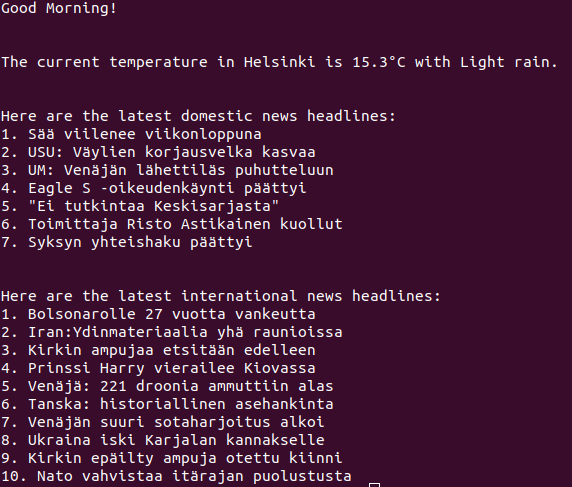

# morning-bot
Morning Briefing Script

## Pre-requisites
- Python 3.8+

## Setup

1. Clone the repository:
   ```bash
   git clone https://github.com/yourusername/morning-bot.git
   cd morning-bot
   ```

2. Create a virtual environment
   ```bash
   python3 -m venv venv
   ```

3. Activate venv
   ```bash
   source venv/bin/activate
   ```

4. Install dependencies
   ```bash
   pip install -r requirements.txt
   ```

5. Set up environment variables
   - Create a `.env` file in the root directory
   - Add your API keys and configurations, e.g.:
     ```
     # ------- Weather -------
      WEATHER_API_KEY=your_weather_api_key

      # ------- News -------
      YLE_API_ID=your_yle_api_id
      YLE_API_KEY=your_yle_api_key
      YLE_DOMESTIC_NEWS_PAGE="102"
      YLE_INTERNATIONAL_NEWS_PAGE="130"
      YLE_ECONOMY_NEWS_PAGE="160"
     ```

6. Run the script
   ```bash
   python src/main.py
   ```


## Current Features
- Fetches weather data from WeatherAPI
- Fetches news headlines from YLE teletext API

Current Output Example:    


## Future Improvements
- Add Telegram/Slack integration for notifications
- Host on a server and schedule daily runs (e.g., using cron jobs)
- Add more data sources (e.g., calendar events, emails, inspirational quotes etc.)
