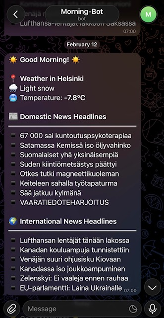

# morning-bot
Morning Briefing Script

## Current Features
- Fetches weather data from WeatherAPI
- Fetches news headlines from YLE teletext API
- Sends message to Telegram chat through a Telegram bot
- Deployed to Google Cloud through Cloud Functions
- Scheduled to run at 7 AM daily using Cloud Scheduler

Output Example:    



## Pre-requisites
- Python 3.8+

## Setup (locally runnable version)

Here are the steps to set up and run the Morning Bot project locally.

Want to set up scheduled deployment on Google Cloud? Follow the instructions in `gcloud_instructions.md`.

1. Clone the repository:
   ```bash
   git clone https://github.com/yourusername/morning-bot.git
   cd morning-bot
   ```

2. Create a virtual environment
   ```bash
   python3 -m venv venv
   ```

3. Activate venv
   ```bash
   source venv/bin/activate
   ```

4. Install dependencies
   ```bash
   pip install -r requirements.txt
   ```

5. Set up environment variables
   - Create a `.env` file in the root directory
   - Add your API keys and configurations, e.g.:
     ```
     # ------- Weather -------
      WEATHER_API_KEY=<your_weather_api_key>

      # ------- News -------
      YLE_API_ID=<your_yle_api_id>
      YLE_API_KEY=<your_yle_api_key>
      YLE_DOMESTIC_NEWS_PAGE="102"
      YLE_INTERNATIONAL_NEWS_PAGE="130"
      YLE_ECONOMY_NEWS_PAGE="160"

      # ------- Telegram Bot -------
      TELEGRAM_BOT_TOKEN=<your_telegram_bot_token>
      TELEGRAM_CHAT_ID=<your_telegram_chat_id>
     ```

6. Run the script
   ```bash
   python src/main.py
   ```
 > NOTE: There is another `main.py` for Google Cloud Functions deployment in root directory. However when running locally use `src/main.py`. The core logic is the same just that the entry point function is wrapped for Cloud Functions.


## Future Improvements
- Embed links to the full news articles that are in the briefing.
- Add more data sources (e.g., calendar events, emails, inspirational quotes etc.)
